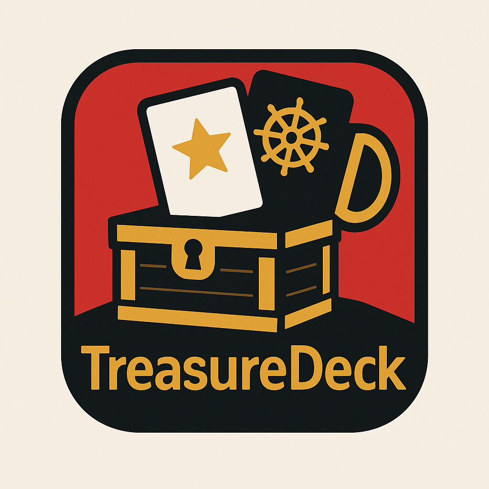
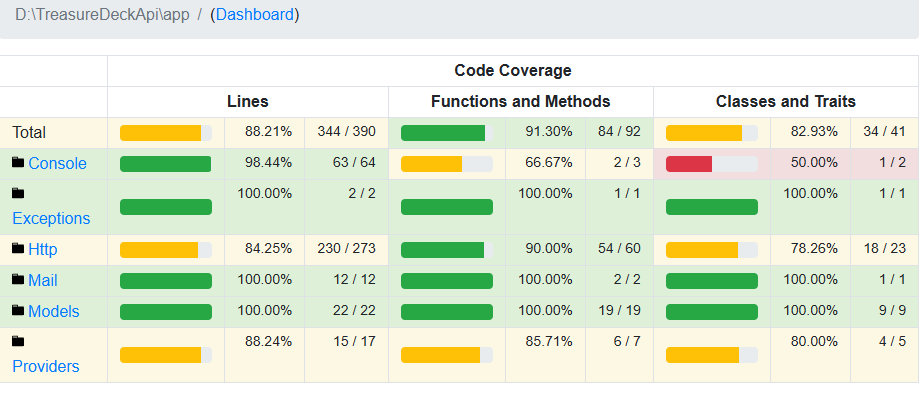
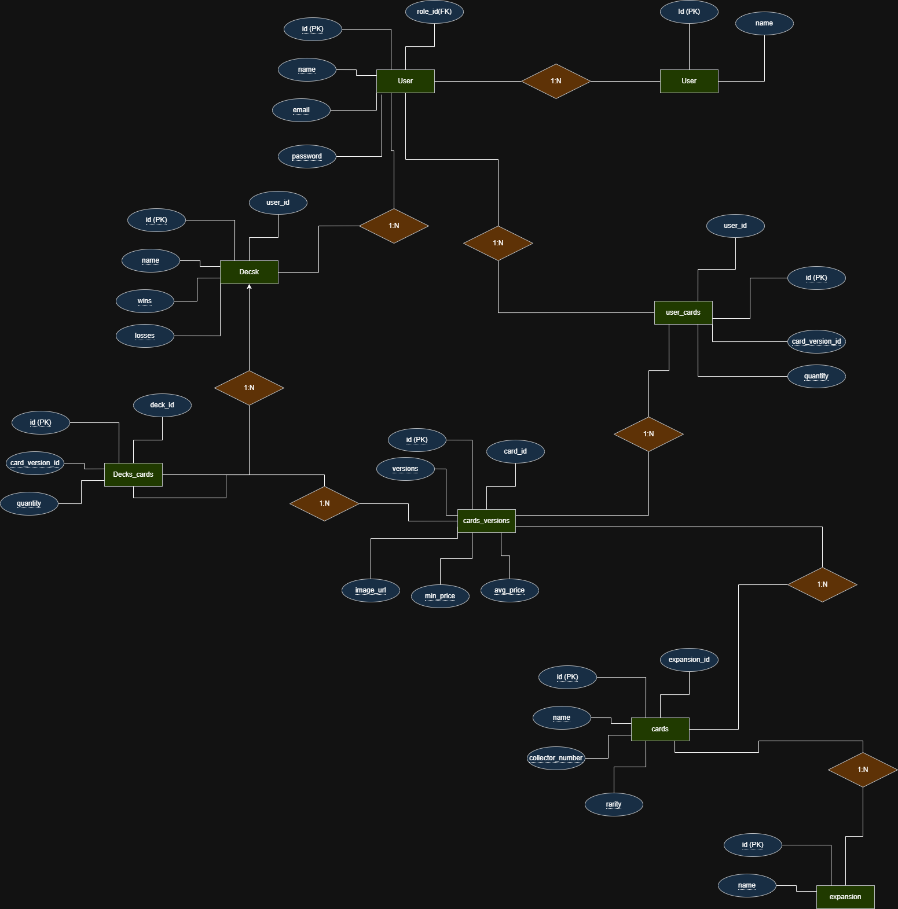
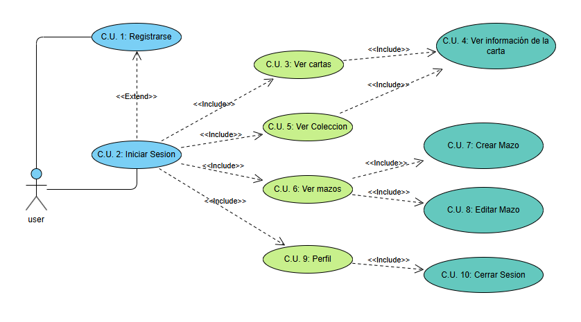

# TreasureDeck



## Documentacion

- [AppTreasureDeck](documentation/AppTreasureDeck.md)
- [Documentacion de Diseño](documentation/DocumentacionDeDiseño.md)
- [Documentacion del Codigo](documentation/DocumentacionDelCodigo.md)
- [EMRTreasureDeck](documentation/EMRTreasureDeck.md)
- [Manual de Uso](documentation/ManualDeUso.md)
- [Manual de Usuario](documentation/ManualDeUsuario.md)


## Descripción

Aplicación móvil para la gestión de cartas coleccionables del juego **One Piece TCG**. Permite a los usuarios almacenar su colección de cartas, consultar su valor de mercado actualizado y registrar estadísticas de partidas ganadas y perdidas.

Esta app está desarrollada con **React Native** para el front-end y **PHP (Laravel)** en el back-end, integrando una API externa para obtener los valores de las cartas en tiempo real.

---

## Tecnologías utilizadas

- **React Native**: Desarrollo multiplataforma (iOS y Android) para la aplicación móvil.
- **PHP (Laravel)**: API REST para la lógica del servidor y gestión de datos.
- **JWT**: Autenticación segura mediante tokens.
- **API CardTrader**: Fuente externa para consultar precios y datos de cartas.
- **MySQL / SQLite**: Base de datos para almacenamiento de usuarios, cartas y estadísticas.
- **PHPUnit**: Testing del backend.

---

## Características principales

- Registro y autenticación de usuarios con correo electrónico y contraseña.
- Gestión de colección personal de cartas: agregar, eliminar y visualizar cartas.
- Consulta en tiempo real del valor de mercado de cada carta usando API externa.
- Registro y seguimiento de estadísticas personales de partidas ganadas y perdidas.
- Interfaz amigable y sencilla para facilitar la experiencia del usuario.

---

## Instalación

### Requisitos previos

- Node.js (v16+ recomendado)
- npm o yarn
- PHP (v8.0+ recomendado)
- Composer
- MySQL o SQLite para base de datos
- Android Studio / Xcode para emulación móvil (opcional)

### Pasos para el backend (API)

1. Clona el repositorio:

   ```bash
   git clone https://github.com/tu_usuario/onepiece-tcg-collection.git
   cd onepiece-tcg-collection/backend


### Test 

Con una cobertura de 88.21%




### diagrama 


## Entidad relacion 



## casos de uso




## Defensa del proyecto

[Defensa](https://www.canva.com/design/DAGojaIwPD4/-oMu_RQHWENacPDTirF09g/edit?utm_content=DAGojaIwPD4&utm_campaign=designshare&utm_medium=link2&utm_source=sharebutton)

