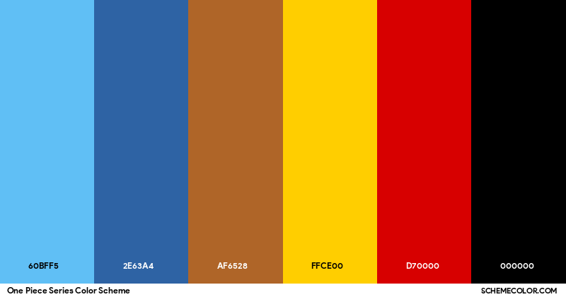
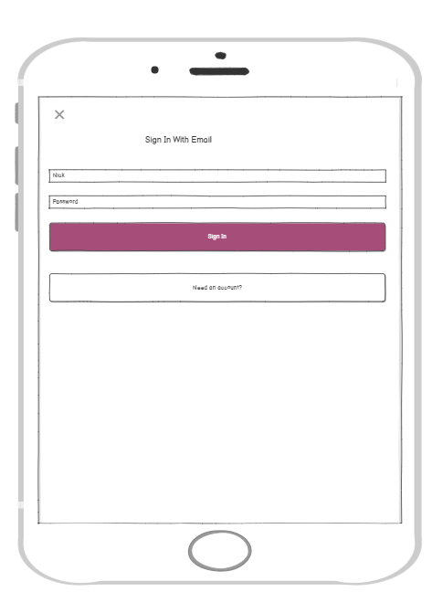
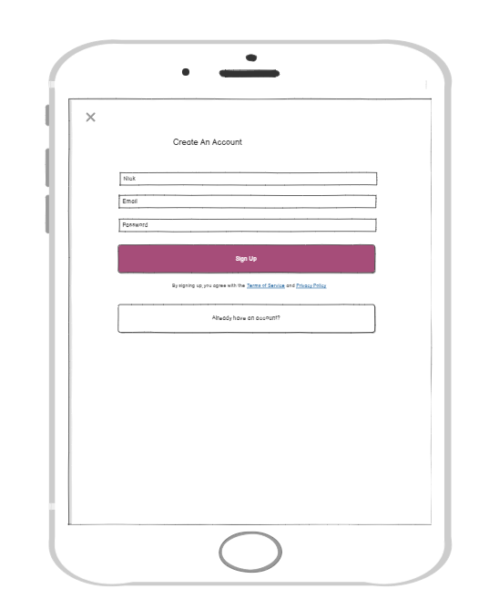
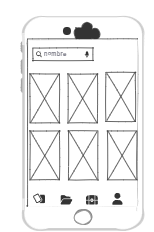
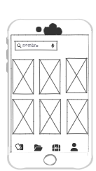
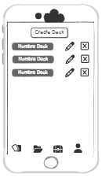
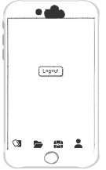

# Documentación de Diseño

## 1. Enfoque de Diseño

El diseño de la aplicación sigue un enfoque **modular y centrado en el usuario**, buscando crear una experiencia intuitiva y eficiente. Se prioriza la claridad visual, la navegación sencilla y la consistencia en la interfaz para que cualquier usuario pueda interactuar con la app sin dificultades. Se adoptó la arquitectura basada en stacks y tabs para separar flujos de autenticación y funcionalidades principales, facilitando la escalabilidad y mantenimiento.

## 2. Paleta de Colores

La paleta de colores utilizada se basa en tonos oscuros combinados con colores vibrantes para resaltar elementos importantes:

Esta combinación aporta un contraste adecuado para la legibilidad y una estética moderna.

## 3. Componentes de Interfaz

La interfaz está construida con componentes nativos de React Native para garantizar rendimiento y compatibilidad:

- **View:** Contenedores principales para layout y agrupación visual.
- **Text:** Para mostrar etiquetas, títulos y contenido.
- **Button:** Para interacciones básicas, como cerrar sesión o navegar.
- **ActivityIndicator:** Indicador de carga para mejorar la respuesta visual durante procesos asíncronos.
- **AsyncStorage:** Para almacenamiento seguro de tokens y persistencia de sesión.

Los estilos se aplican mediante `StyleSheet` para mantener consistencia y separar presentación de lógica.

## 4. Experiencia de Usuario (UX)

- Navegación simple y clara, con flujo diferenciado entre autenticación y funcionalidades principales.
- Mensajes claros en caso de errores o cargas (por ejemplo, indicador de carga mientras se obtiene el perfil).
- Botón único para cerrar sesión en la pantalla de perfil, evitando confusión.
- Feedback visual y responsividad para todas las interacciones.
- Minimización de pasos para lograr tareas comunes como login o edición de perfil.

## 5. Wireframes y Prototipos

- **Wireframes iniciales** se diseñaron para estructurar las pantallas principales: Login, Registro, Perfil, Listado de cartas y mazos.
- **Prototipos interactivos** se desarrollaron en herramientas como Figma para validar la navegación y disposición de elementos antes de la implementación.

### Login 

### Register 

### Cards 

### Collection 

### Decks 

### Logout 

## 6. Recomendaciones Futuras

- Incorporar **diseño responsivo** para diferentes tamaños de pantalla y dispositivos.
- Añadir **temas claros y oscuros** para personalización del usuario.
- Implementar **componentes reutilizables y librerías de UI** para acelerar el desarrollo y mantener consistencia.
- Mejorar la gestión de estado con herramientas como **Redux** o **Context API** para flujos más complejos.
- Integrar feedback táctil avanzado y animaciones para enriquecer la experiencia.
- Realizar pruebas de usabilidad periódicas para detectar áreas de mejora y adaptar el diseño a las necesidades reales de los usuarios.
